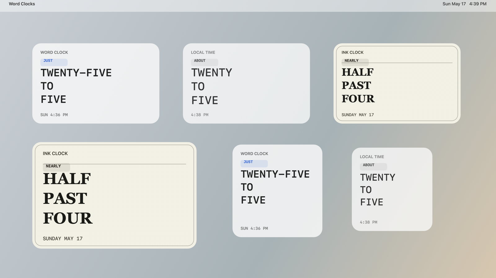
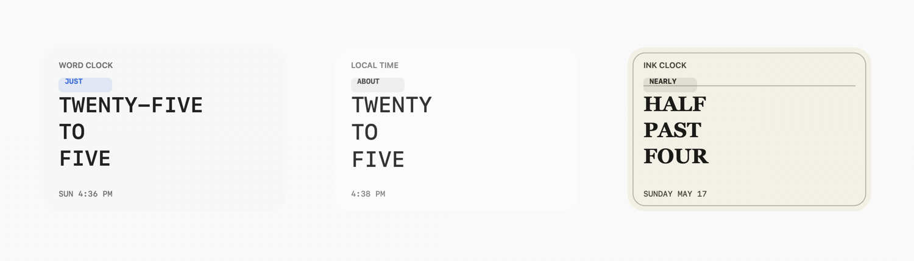

# Word Clocks

Word Clocks is an open-source collection of native word-clock widgets and shared clock logic. The first implementation is a Swift package for Apple platforms, starting with a three-word clock inspired by `delhoume/trmnl_wordclock`.

The long-term direction is a collection of installable widgets for macOS, iOS, Apple Watch, and eventually Linux. The core logic should stay small and reusable so platform targets can share behavior while still feeling native.

## Screenshots





## Repository Layout

- `Sources/WordClocks`: Swift package source.
- `Tests/WordClocksTests`: Swift unit tests.
- `Apps/WordClocksMac`: Native macOS containing app.
- `Apps/WordClocksWidgetsExtension`: WidgetKit extension for desktop widgets.
- `project.yml`: XcodeGen project definition. `WordClocks.xcodeproj` is generated locally.
- `script`: Local setup, build, run, and widget-debug helpers.
- `references`: Ignored local clones and reference projects. Only `references/README.md` is tracked.

## Local Reference Clone

The TRMNL word clock project is useful source material, but it is not committed into this repository.

```sh
gh repo clone delhoume/trmnl_wordclock references/trmnl_wordclock
```

The upstream project is published under The Unlicense / public-domain terms. Keep attribution in docs when borrowing ideas or implementation details.

## Development

Run the Swift test suite:

```sh
swift test
```

Generate the Xcode project:

```sh
brew bundle
xcodegen generate
```

Build and launch the macOS containing app:

```sh
./script/build_and_run.sh --verify
```

This also registers the embedded WidgetKit extension with PlugInKit. A successful local widget build prints:

```text
WordClocksMac is running.
com.vicyap.WordClocks.widgets is registered with PlugInKit.
```

Build the WidgetKit extension and open the project for widget debugging:

```sh
./script/debug_widget.sh
```

The WidgetKit extension exposes three native macOS desktop widgets: "Three Word Clock - Classic", "Three Word Clock - Minimal", and "Three Word Clock - Ink". Each supports small, medium, and large families. After launching the debug app, open the macOS widget gallery and add the Word Clocks widgets to the desktop.

If the widget gallery was already open before building, close and reopen it. If the widget still does not appear, refresh Notification Center and rebuild:

```sh
killall NotificationCenter
./script/build_and_run.sh --verify
```

The current package exposes English three-word clock phrase logic using minute-aware approximate phrasing. The main phrase stays within three display words, while `JUST`, `ABOUT`, and `NEARLY` are exposed separately as an optional qualifier around the nearest five-minute spoken anchor:

```swift
import WordClocks

let clock = ThreeWordClock()
let phrase = clock.phrase(hour: 16, minute: 36)

print(phrase.qualifier ?? "") // JUST
print(phrase.text) // TWENTY-FIVE TO FIVE
print(phrase.displayLines) // ["TWENTY-FIVE", "TO", "FIVE"]
```

## Roadmap

- Finish macOS widget gallery verification: confirm Classic, Minimal, and Ink appear as separate widgets with small, medium, and large sizes only.
- Replace or supplement the generated README images with live desktop screenshots after the gallery flow is confirmed.
- Tighten the local widget debug path around Notification Center refreshes, PlugInKit registration, and stale WidgetKit/Chrono caches.
- Polish the macOS layouts against real gallery previews, especially qualifier placement, type scale, and minute-boundary updates.
- Add more tested phrase modules, languages, and clock styles after the macOS WidgetKit path is stable.
- Plan iOS and Apple Watch targets once the shared Swift package and macOS widgets are boring to build and verify.

## License

This repository is available under the MIT License. See `LICENSE`.
